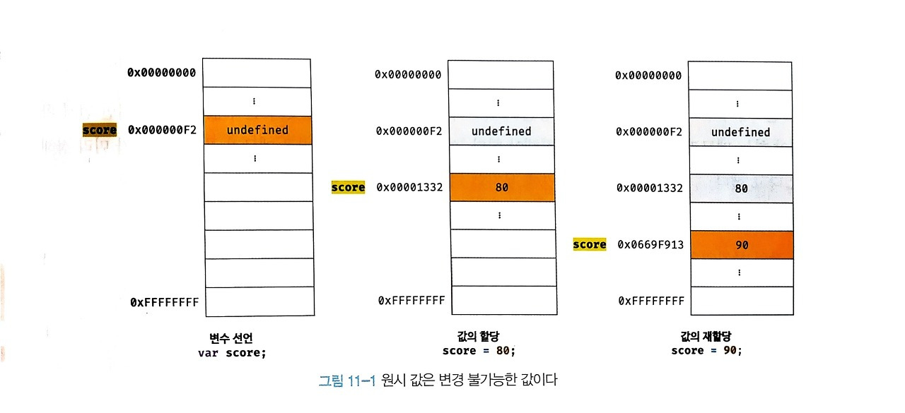

# 할당 vs. 변이

JavaScript에서 `const` 키워드는 상수를 선언하는 데 사용됩니다. 상수는 종종 "변경할 수 없는 변수"로 생각됩니다:

```javascript
const hi = 5;
hi = 10;
// 🛑 Uncaught TypeError: 상수 변수에 할당할 수 없습니다.
console.log(hi);
// -> 5
```

하지만 흥미롭게도, `const`를 사용하여 객체를 생성할 때는 자유롭게 변경할 수 있습니다:

```javascript
const person = {
  name: "Hassan",
};
person.name = "Sujata";
// 작동하는 것 같습니다?? 🤔
console.log(person);
// -> { name: 'Sujata' }
```

어떻게 `person` 변수를 변경할 수 있었을까요? `const`를 사용했는데도 말이죠!

이 명백한 모순을 이해하려면 할당과 변이의 차이를 알아야 합니다. 이는 JavaScript의 핵심 개념이며, 이 구분을 명확히 이해하면 많은 것들이 더 이해하기 쉬워집니다.

자, 시작해 봅시다!

## 변수 이름을 라벨로 생각하기

다음은 완벽히 유효한 JavaScript 프로그램입니다:

```javascript
5;
```

다음도 마찬가지입니다:

```javascript
["apple", "banana", "cherry"];
```

앞서 배웠듯이, JavaScript 프로그램은 문(statement)으로 구성되며, 문에는 "표현식 슬롯"이 있습니다. 위의 두 경우 모두 문에는 표현식 슬롯만 포함되어 있습니다. 우리는 어떤 것(숫자, 배열)을 생성하고 메모리에 저장하고 있습니다.

하지만 이 프로그램들은 그다지 유용하지 않습니다. 우리가 생성한 데이터에 접근할 방법이 없기 때문입니다!

변수를 사용하면 우리가 생성한 것들에 라벨을 붙여 나중에 참조할 수 있습니다:

```javascript
// 지금 생성하고...
const fruits = ["apple", "banana", "cherry"];
// ...나중에 접근합니다:
console.log(fruits);
// -> ['apple', 'banana', 'cherry']
```

프로그래밍을 처음 배울 때, 저는 코드가 왼쪽에서 오른쪽으로 실행된다고 생각했습니다: 먼저 빈 상자와 같은 `fruits` 변수를 만들고, 그 다음 그 상자 안에 배열을 조립한다고 생각했죠.

그러나 이는 정확한 정신 모델이 아닙니다. 배열이 먼저 생성되고, 그 다음 우리의 `fruits` 라벨이 그것을 가리키는 것이 더 정확한 설명입니다.

## "변수"?

이 과정에서 저는 `let`이나 `const` 중 어느 것을 사용하든 상관없이 데이터에 주어진 모든 이름을 "변수"라고 부르겠습니다:

```javascript
// 이것은 변수입니다:
let age = 26;
// 이것도 변수입니다:
const favouriteColor = "hotpink";
```

이것이 혼란스럽다는 것을 인정합니다; "변수"라는 용어는 뭔가가 변할 수 있다는 것을 암시하니까요! 안타깝게도, "변수"는 JavaScript에서 `let`과 `const`(그리고 더 이상 사용되지 않는 `var` 키워드)를 모두 포함하는 확립된 포괄적 용어입니다.



## 라벨 재할당하기

`let` 키워드를 사용하여 변수를 만들 때, 우리는 그 라벨이 가리키는 "것"을 변경할 수 있습니다.

예를 들어, 우리의 `fruits` 라벨을 새로운 값을 가리키도록 할 수 있습니다:

```javascript
let fruits = ["apple", "banana", "cherry"];
fruits = ["durian", "eggplant", "fig"];
fruits = ["honeydew"];
fruits = 27;
fruits = null;
```

이를 재할당이라고 합니다. 우리는 `fruits` 라벨이 실제로 완전히 다른 값을 가리켜야 한다고 말하고 있는 것입니다.

우리는 데이터를 수정하는 것이 아니라 라벨을 수정하고 있습니다. 원래 배열에서 라벨을 떼어내고 새로운 배열에 연결하는 것입니다.

반면에 `const`로 생성된 변수는 재할당할 수 없습니다:

```javascript
const fruits = ["apple", "banana", "cherry"];
// 이 모든 시도는 오류를 발생시킵니다:
fruits = ["durian", "eggplant", "fig"];
fruits = null;
```

이것이 `let`과 `const`의 근본적인 차이점입니다. `const`를 사용할 때, 우리는 변수 이름과 데이터 조각 사이에 파괴할 수 없는 연결을 만듭니다.

하지만 여기서 중요한 점은 데이터 자체는 여전히 수정할 수 있다는 것입니다! 라벨이 그대로 유지되는 한 말이죠.

예를 들어, 배열의 경우 문제없이 항목을 추가/제거할 수 있습니다. `fruits` 변수는 여전히 같은 배열에 연결되어 있습니다:

```javascript
const fruits = ["apple"];
fruits.push("banana");
fruits.push("cherry");
console.log(fruits);
// -> ['apple', 'banana', 'cherry']
```

이를 변이(mutation)라고 합니다. 우리는 항목을 추가/제거하여 배열의 값을 편집하고 있습니다.

다음은 배열 대신 객체를 사용한 또 다른 예입니다. 라벨이 같은 객체를 계속 가리키는 한, 객체 내의 키/값을 편집할 수 있습니다:

```javascript
const event = {
  title: "변경해보세요!",
  startsAt: "2023-05-29T16:00:00Z",
  duration: 4,
  confirmed: true,
};
event.title = "새로운 제목";
console.log(event.title);
// -> '새로운 제목'
```

재할당(변수 이름을 새로운 것을 가리키도록 하는 것)과 변이(그 안의 데이터를 편집하는 것) 사이에는 근본적인 차이가 있습니다.

`const`로 상수를 만들 때, 우리는 변수가 절대 재할당되지 않을 것이라고 100% 확신할 수 있지만, 변이에 대해서는 아무런 약속도 하지 않습니다. `const`는 변이를 전혀 막지 않습니다.

여기에 한 가지 더 복잡한 점이 있습니다: 문자열과 숫자 같은 "원시" 데이터 타입은 불변입니다. 이는 상황을 더욱 혼란스럽게 만듭니다.

## 객체와 배열 동결하기

따라서 좌절스럽게도 `const` 키워드는 변이로부터 우리를 보호해주지 않습니다. 우리의 데이터가 편집되지 않도록 보장할 다른 방법이 있을까요?

있습니다! `Object.freeze()` 라는 유용한 메서드가 있습니다:

```javascript
// 배열의 경우:
const arr = Object.freeze([1, 2, 3]);
arr.push(4);
console.log(arr);
// -> [1, 2, 3]
// 객체의 경우:
const person = Object.freeze({ name: "Hassan" });
person.name = "Sujata";
console.log(person);
// -> { name: 'Hassan' }
```

`Object.freeze()`는 완벽합니다. 이 메서드를 사용하여 동결된 객체/배열을 수정할 방법은 없습니다.

단, 이는 "얕은" 동결만 수행한다는 점에 유의하세요. 깊이 중첩된 객체나 배열은 동결하지 않습니다.

## 원시 데이터 타입

지금까지 본 모든 예제는 객체와 배열에 관한 것이었습니다. 하지만 문자열, 숫자, 불리언 값과 같은 "원시" 데이터 타입의 경우는 어떨까요?

숫자를 예로 들어보겠습니다:

```javascript
let age = 36;
age = 37;
```

이를 어떻게 해석해야 할까요? `age` 라벨을 새 값으로 재할당하는 것일까요, 아니면 이 숫자를 변이시켜 36을 37로 편집하는 것일까요?

여기서 중요한 점은 다음과 같습니다: JavaScript의 모든 원시 데이터 타입은 불변입니다. 숫자의 값을 "편집"하는 것은 불가능합니다. 우리는 변수를 다른 값으로 재할당할 수만 있습니다.

제가 이를 생각하는 방식은 이렇습니다: 모든 가능한 숫자의 큰 목록이 있다고 가정해보세요. 우리는 `age` 변수를 숫자 36에 할당했지만, 목록의 다른 어떤 숫자로도 가리킬 수 있습니다.

명확히 하자면, 브라우저가 실제로 모든 가능한 숫자의 큰 인덱스를 가지고 있는 것은 아닙니다. 제가 여기서 설명하고자 하는 점은 숫자 자체는 변경될 수 없다는 것입니다. 우리는 라벨이 가리키는 숫자만 변경할 수 있습니다.

이는 문자열, 불리언 값, null 등 모든 원시 값 타입에 해당됩니다.

## 사고 실험

앞서 언급했듯이, JavaScript에서 원시 값은 "불변"입니다; 편집할 수 없습니다.

하지만 만약 편집할 수 있다면 어떨까요? 숫자 자체를 변이할 수 있다면 구문은 어떤 모습일까요?

다음과 같은 모습일 것입니다:

```javascript
// 숫자 36의 값을 편집합니다:
36 = 37;
// 숫자 36은 더 이상 존재하지 않습니다!
console.log(36); // -> 37
```

"변이"의 전체 아이디어는 그 값을 근본적으로 변경한다는 것입니다. 객체를 변이시킬 때, 우리는 그 객체의 "본질"을 변경하고, 그것을 참조할 때 그 변경사항을 볼 수 있습니다:

```javascript
const me = { age: 36 };
me.age = 37;
console.log(me);
// -> { age: 37 }
```

따라서 JavaScript에서 원시 값을 변이할 수 있다면, 본질적으로 특정 숫자를 덮어써서 다시는 참조할 수 없게 만드는 것을 의미할 것입니다!

이는 분명히 혼란스럽고 도움이 되지 않을 것이며, 이것이 JavaScript에서 원시값이 불변인 이유입니다.
